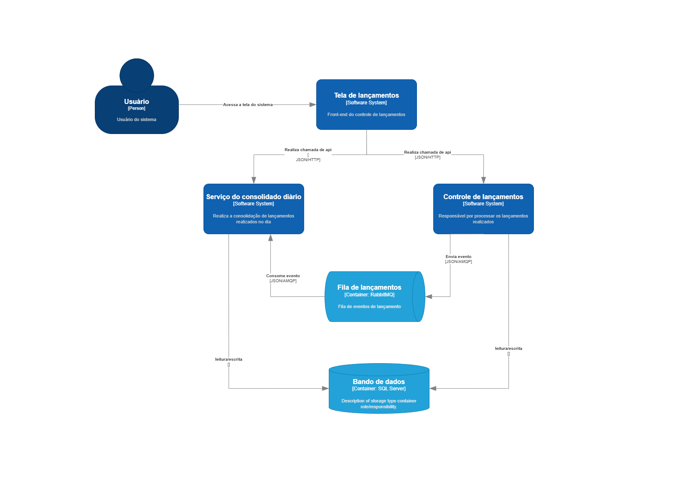

# Sistema de Lançamentos Financeiros

Este projeto implementa um sistema completo para gerenciamento de lançamentos financeiros, composto por múltiplos serviços backend e um frontend que se comunicam para oferecer funcionalidades como registro de transações, consolidação diária e visualização de relatórios.

## Visão Geral da Solução


O sistema foi construído utilizando uma arquitetura de serviços distribuídos, com:

- **ControleDeLancamentos API**: Serviço principal para gerenciamento de transações financeiras
- **ConsolidadoDiario API**: Serviço responsável por consolidar e analisar os lançamentos diários
- **Frontend React**: Interface de usuário para interação com o sistema
- **Banco de Dados SQL Server**: Armazenamento persistente de dados
- **RabbitMQ**: Serviço de mensageria para comunicação assíncrona entre os serviços



### Tecnologias Utilizadas

- **.NET 8**: Framework para desenvolvimento das APIs
- **Entity Framework Core**: ORM para acesso a dados
- **React**: Biblioteca para construção da interface do usuário
- **Docker & Docker Compose**: Containerização e orquestração dos serviços
- **Nginx**: Servidor web e proxy reverso para o frontend
- **SQL Server**: Sistema de gerenciamento de banco de dados
- **RabbitMQ**: Broker de mensagens

## Comunicação entre os Projetos

1. **Frontend → APIs**:
   - O frontend React se comunica com as APIs através do Nginx que atua como proxy reverso
   - Rotas `/api/lancamentos/` são direcionadas para o serviço ControleDeLancamentos
   - Rotas `/api/consolidados/` são direcionadas para o serviço ConsolidadoDiario

2. **ControleDeLancamentos → ConsolidadoDiario**:
   - Quando um novo lançamento é registrado, o serviço ControleDeLancamentos publica uma mensagem na fila `lancamentos` do RabbitMQ
   - O serviço ConsolidadoDiario consome essas mensagens e atualiza seus dados de consolidação

3. **Persistência de Dados**:
   - Ambos os serviços backend se conectam ao SQL Server para persistência
   - Cada serviço possui seu próprio contexto e modelo de dados
   - As migrações são executadas automaticamente na inicialização

## Como Executar Localmente

### Pré-requisitos

- Docker e Docker Compose instalados
- Git para clonar o repositório

### Passos para Execução

1. **Clone o repositório**:
   ```bash
   git clone https://github.com/pedrohorita/SistemaLancamentosFinanceiros.git
   cd SistemaLancamentosFinanceiros
   ```

2. **Inicie os serviços com Docker Compose**:
   ```bash
   docker-compose up -d
   ```

3. **Acesse o sistema**:
   - Frontend: http://localhost:3000
   - API de Lançamentos: http://localhost:7105
   - API de Consolidado: http://localhost:7106
   - RabbitMQ Management UI: http://localhost:15672 (guest/guest)
   - SQL Server: localhost:14333 (sa/X7@pL9qW#zT2)

### Estrutura de Diretórios

```
SistemaLancamentosFinanceiros/
├── ControleDeLancamentos/         # API de controle de lançamentos
│   ├── ControleDeLancamentos/     # Projeto API
│   ├── ControleDeLancamentos.Application/
│   ├── ControleDeLancamentos.Domain/
│   ├── ControleDeLancamentos.Infrastructure/
│   └── ControleDeLancamentos.Tests/
├── ConsolidadoDiario/             # API de consolidação diária
│   ├── ConsolidadoDiario/         # Projeto API
│   ├── ConsolidadoDiario.Application/
│   ├── ConsolidadoDiario.Domain/
│   ├── ConsolidadoDiario.Infrastructure/
│   └── ConsolidadoDiario.Tests/
├── ControleDeLancamentos-front/   # Frontend React
│   ├── public/
│   ├── src/
│   ├── Dockerfile
│   └── nginx.conf
├── scripts/                       # Scripts utilitários
│   └── migrations/                # Scripts para migrações
├── docker-compose.yml             # Configuração do Docker Compose
└── Dockerfile.migrations          # Dockerfile para migrações
```

## Depuração e Solução de Problemas

- **Logs de Serviços**:
  ```bash
  docker-compose logs -f controle-lancamentos-api
  docker-compose logs -f consolidado-diario-api
  docker-compose logs -f frontend
  ```

- **Banco de Dados**:
  Conecte-se usando SQL Server Management Studio ou Azure Data Studio com:
  - Servidor: localhost,14333
  - Usuário: sa
  - Senha: X7@pL9qW#zT2

- **RabbitMQ**:
  Acesse http://localhost:15672 com usuário e senha "guest" para monitorar filas e mensagens.

## Estrutura de APIs

- **ControleDeLancamentos API**:
  - `GET /api/lancamentos`: Lista todos os lançamentos
  - `POST /api/lancamentos`: Cria um novo lançamento
  - `GET /api/lancamentos/{id}`: Obtém um lançamento específico
  - `PUT /api/lancamentos/{id}`: Atualiza um lançamento
  - `DELETE /api/lancamentos/{id}`: Remove um lançamento

- **ConsolidadoDiario API**:
  - `GET /api/consolidados`: Lista consolidados diários
  - `GET /api/consolidados/{data}`: Obtém consolidado de uma data específica

---

Este README fornece uma visão geral da solução. Para mais detalhes sobre cada componente, consulte a documentação específica em cada pasta do projeto.